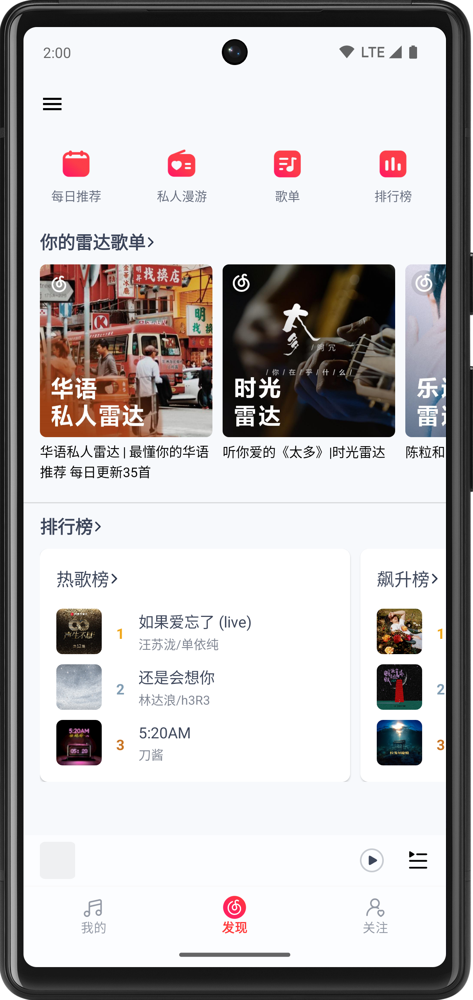
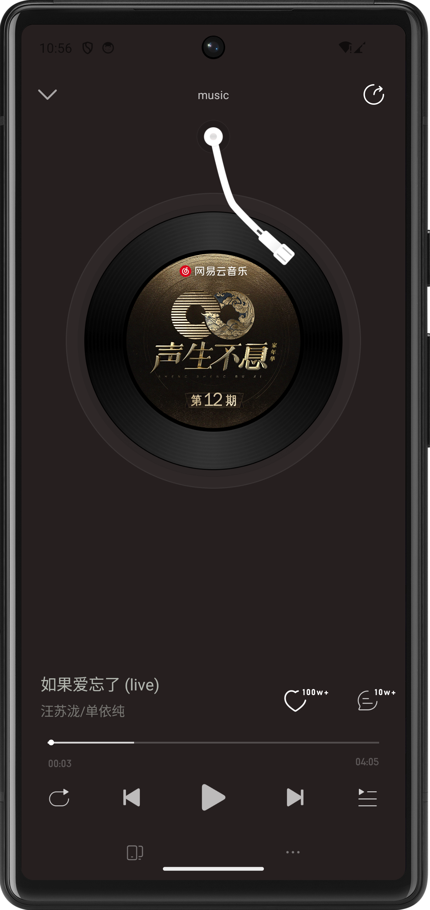
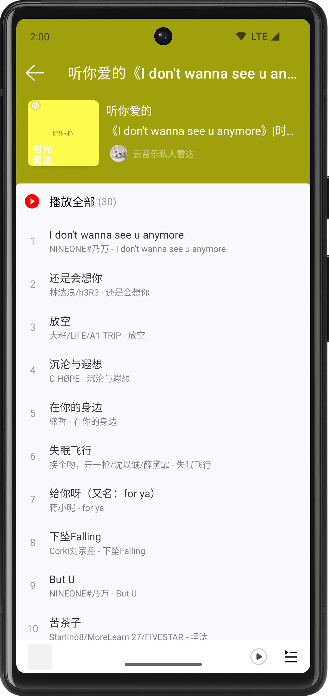
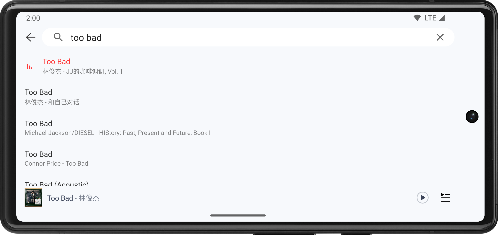

# MinusOne Music

**MinusOne Cloud Music** (减一云音乐, app name: *MinusOne Music*) is a lightweight, third-party NetEase Cloud Music (NCM) client for Android, currently in an inactive (though not abandoned) state of early development.

This project was started as a foundational learning experience, and its current codebase is a candid reflection of the developer's skills and architectural understanding at the time.

To align the project with current best practices and showcase significant skill progression, a full migration to **Jetpack Compose** is planned. This strategic refactor will not only modernize the application with a declarative UI but also serve as a practical demonstration of developer growth.

### Development Progress

- Implemented

  - 我的
    - **我的—音乐**
  - 播放
    - **迷你播放器**
    - **播放页**
    - **播放列表（即歌单）**
  - 发现
    - **每日推荐**

- Partial Implementation

  - **验证码登录** [prone to failure] / **密码登录** [doesn't work, hidden] / **退出登录**
  - 我的
    - **最近播放—歌曲**
    - **云盘**
    - **本地音乐**
    - **听歌排行**
  - 发现
    - **发现首页（顶部入口、私人雷达、排行榜）**
    - **排行榜**
  - **搜索（“综合”Tab之“单曲”）**
  - **评论（Hottest Page 1）**

  > Note: The interfaces listed generally do not include secondary screens or dialogs. Other UI elements and functionalities are in very early stages, though some initial drafts exist.

## Features

- The app aims to provide a 99% pure music experience with basic support for social features (which are not yet implemented).
  - **-1 (jiǎn yī)!**
    - No ads, podcasts, or social squares
    - Minimal VIP UI elements
    - Tailored UI content
    - Small APK size
    - Core functionalities and UI are retained on a best-effort basis
    - Non-additive or subtractive modifications (some UI/behavioral changes will be configurable in Settings)
    - No extra features
  - Music playback
  - Tablet/landscape support without special adaptations
- Direct NCM API integration (utilizing endpoints not publicly documented)
- View-based system & Single Activity architecture
- **NOT** a modification of the decompiled official app, despite visual similarities
- Does **NOT** hack music resources

## Notices

- Users are strongly encouraged to use the official NCM app. By using this application, you agree to the following:
  - It must coexist with the official NCM app.
  - **Source Availability:** The project is primarily closed-source, with a public repository for a curated set of non-sensitive files. The expansion of public code is on hold pending a major cleanup, while a full source release is not planned to avoid potential copyright infringement.
  
- ### Usage Guidelines

  - For personal learning purposes only.
  - Do not share without permission.

## Screenshots

|                                            My Music                                             |                                       Discover                                       |
|:-----------------------------------------------------------------------------------------------:|:------------------------------------------------------------------------------------:|
|                 |  |
|                                         **Now Playing**                                         |                                     **Playlist**                                     |
|  |  |

### Large Screen / Landscape

## To-dos

- Code optimization
  - Refactoring
  - Display missing error messages
- Compose
  - Migrate
    - RecyclerView to LazyList
- Nav UI
  - NavigationSuiteScaffold
- Request compressed images
- Play log (help needed)
- New screens / major features
  - Personal FMs
  - Friends
  - MVs
  - Playlist Square (uncertain if it's necessary)
  - Statusbar lyrics
- Player & playlist UI
  - Fix progress visual sync
  - Mini Player Bar
    - Swipe
    - Hide like `PlayControlView`
  - Transition between Mini Player Bar & Now Playing
  - Now Playing
    - Fix badge visibility issue
    - Follow
    - Volume control dialog for legacy systems
    - LinearLayout weight distribution for controls
    - Disk rotation like https://music.163.com/m/song
  - Playlist UI items
    - Actions
    - Cloud/favorite/试听(trial)/unavailable UI state
  - Link local/downloaded songs with remote ones
    - Lyrics and cover matching
  - On-boarding
  - Show current audio qualities
- Player
  - Continue the work of moving Player to VM
  - Handle fetch error
- Search
  - Hint
- Mine
  - Add shadow for profile background
  - Top crop profile background
  - Fix top margin of user profile
- Arch
  - Sync user data with `WorkManager` instead
  - More caching: Playlist, lyrics ...
- Update UI for latest NCM
  - Mini player bar
  - Player screen
  - “网易云听劝”
- Settings
  - About
  - Link of APK of latest NCM
- SMS login
  - UI
  - Fix missing submit code button
  - Track stability
- Upgrade persistence layer to DataStore
- Share
- Volume balance
- The UI is generally not interactive enough
- Rearrange UI for landscape like NCM
- Download: advanced
- Firebase Crashlytics

### Important non-to-dos

- Additional search tabs/pagination
- Custom default audio quality (320 kbps is preferred when making requests)
- Advanced cover disk

## Tech Stack

- [Foundation][foundation]: [Android KTX][android-ktx]
- [Architecture][arch]
  - [Data Binding][data-binding]
  - [Lifecycle][lifecycle]
  - [Navigation 3][navigation-3]
  - [Paging][paging]
  - [Room][room]
  - [ViewModel][viewmodel]
  - [WorkManager][workmanager] (TODO)
  - DataStore & SharedPreferences
- [UI][ui]
  - [Animations & Transitions][animation]
  - [Fragment][fragment]
  - [Layout][layout]
  - Compose
- Behavior
  - [Notifications][notifications]
  - Media3
- Third party and miscellaneous libraries
  - [Kotlin Coroutines][kotlin-coroutines]
  - `javax.crypto`
  - [Retrofit][retrofit]
  - Moshi
  - Coil 3
  - Chucker
  - PersistentCookieJar

[foundation]: https://developer.android.com/jetpack/components
[android-ktx]: https://developer.android.com/kotlin/ktx
[arch]: https://developer.android.com/jetpack/arch/
[data-binding]: https://developer.android.com/topic/libraries/data-binding/
[lifecycle]: https://developer.android.com/topic/libraries/architecture/lifecycle
[navigation-3]: https://developer.android.com/guide/navigation/navigation-3
[paging]: https://developer.android.com/topic/libraries/architecture/paging/v3-overview
[room]: https://developer.android.com/topic/libraries/architecture/room
[viewmodel]: https://developer.android.com/topic/libraries/architecture/viewmodel
[workmanager]: https://developer.android.com/topic/libraries/architecture/workmanager
[ui]: https://developer.android.com/guide/topics/ui
[animation]: https://developer.android.com/training/animation/
[fragment]: https://developer.android.com/guide/components/fragments
[layout]: https://developer.android.com/guide/topics/ui/declaring-layout
[notifications]: https://developer.android.com/develop/ui/views/notifications
[retrofit]: https://square.github.io/retrofit/
[kotlin-coroutines]: https://kotlinlang.org/docs/reference/coroutines-overview.html

## Utilities used

- jadx-gui
- HTTPCanary
- Crypto tools
- Copybara

## References

- NCM app/service repos, including a well-known one
- Media3 references:
  - uamp-media3
  - horologist/media
  - socialite
  
## :coffee:

:heart:  

## License

This project is licensed under the **MIT License**. See the [LICENSE](LICENSE) file for the full license text.

## Misc.

Misc.

- **On the project's name:** The project was initially named 'NaCl,' derived from the letters in the official NCM app's name. This was intended to signify its role as a "lite" alternative, reflecting both the developer's technical limitations and the intentional omission of non-essential features. However, the name was changed to avoid confusion with 'Salt Music,' another existing music app. The current name, MinusOne Cloud Music, was chosen to align with both the official NCM app's '-1' slogan and its naming format.

- **On security and cryptography:** The project includes a very basic NDK implementation. While arguably redundant for an application of this scale, it was incorporated primarily as a valuable learning exercise.

